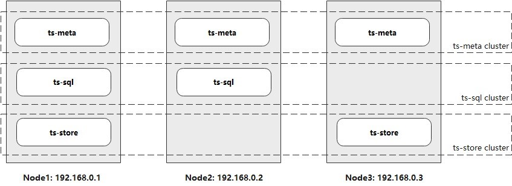
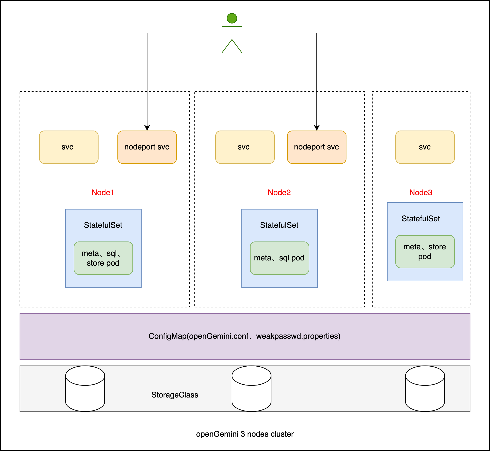
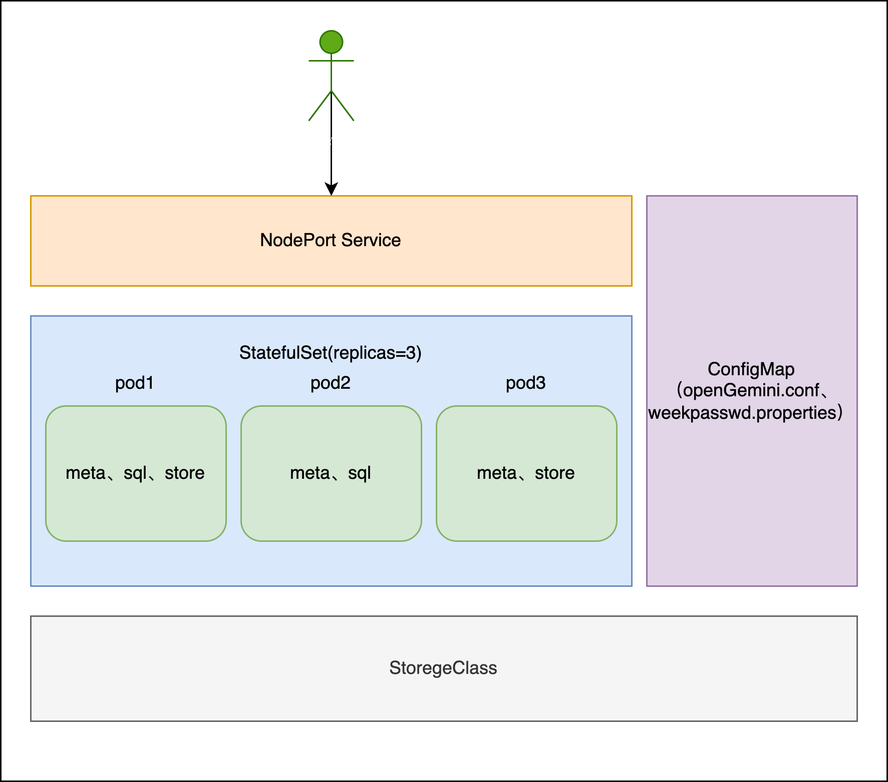
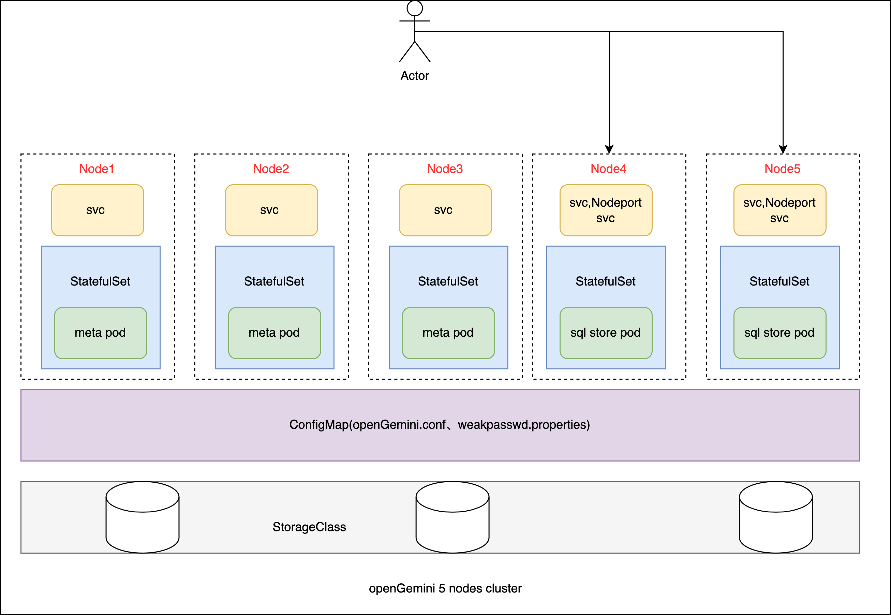

## 使用Helm3 部署分布式openGemini

本项目主要针对部署生产的 `openGemini` 集群，测试或单节点可直接使用社区提供的[方案](https://docs.opengemini.org/zh/guide/quick_start/get_started.html)部署。

### 1.版本说明

当前 `openGemini` 社区最新[版本](https://github.com/openGemini/openGemini/tags)为 `1.1.0`，以下镜像基于`1.1.0`制作。

### 2. 部署架构

参考官方部署架构，思考了两种部署方式，都是三节点集群部署：



**具体可参考社区[文档](https://docs.opengemini.org/zh/guide/quick_start/deploy_cluster.html#%E6%A0%87%E5%87%86%E9%9B%86%E7%BE%A4%E9%83%A8%E7%BD%B2)**

- 部署方式一：

  

  

- 部署方式二：

  

**以上两种部署方式都是，3节点的官方标准集群架构，区别有以下几点：**

1. 方式一 `1` 个节点使用一个独立的 `StatefulSet` 部署，可以分别把 `3` 个  `StatefulSet` 看成 `3` 个独立的 `K8s` 服务，每个服务各自管理自己的资源，资源隔离性较好；
2. 方式二整个集群使用 `1` 个 `StatefulSet`，设置副本数 `3` ，整个集群是一个服务，资源共享，隔离性较差；
3. 看似方式 `2` 比较优雅简洁，但方式二有个很大的缺点，存储是在 `StatefulSet` 配置的，换句话说，方式二中 `3`  个 `pod` 的中的磁盘是相互可见的，即使 `pod1` 只读写` volumn1`，但`pod2`、`pod3` 的`volumn2`、`volumn3` `pod1`也是可见并可以操作的，这可能带来磁盘的误操作或程序资源抢占导致程序不可预知错误。

**综上分析最终采用了方式一部署，对应的helm chart 为 cluster-v1，和社区开发人员交流后，比较高性能的部署方式是：3个ts-meta节点独立部署，ts-sql、ts-store 合并部署，集群的负载都在ts-sql、ts-store节点上，随着集群的负载变大横向扩展ts-sql、ts-store节点就能增加集群的吞吐能力。这就是cluster-v2的部署方式，cluster-v2部署架构如下：**



### 3. 部署准备

- 可用的 `K8s` 集群
- 安装了 `helm3` 的 `k8s` 节点
- `k8s` 集群中有可用的 `StorageClass`

### 4. Cluster-v1 配置部署

1. 下载 `opengemini-cluster-v1.tgz`  `helm` 包，并解压。

2. 修改 `values.yaml` 集群配置

   ```yaml
   # Default values for opengemini.
   # This is a YAML-formatted file.
   # Declare variables to be passed into your templates.
   
   opengemini:
     createNamespace: false # 默认不创建Namespace，设置值为true会创建k8s Namespace
     namespace: my-opengemini # k8s Namespace
     image: zealzhangz/opengemini-1.1.0-v1:latest # 镜像
     pullPolicy: IfNotPresent  # 镜像拉取策略
     storageClassName: my-sc  #！！！重要！！！设置自己 k8s 可用的 StorageClass
     metaSqlStore:          # Node1：包含 ts-meta,ts-sql,ts-store
       name: meta-sql-store # 名称不能改
       sqlNodePort: 30980   #对外开放的访问端口，可用ts-cli 连接 
       dataStorageSize: 2Ti #数据盘大小，StorageClass 需满足可用大小
       logStorageSize: 3Gi  #日志盘大小，StorageClass 需满足可用大小
       cpuNumber: 16         #设置CPU数
       memorySize: 32G        #设置内存数
     metaSql:               # Node2：包含 ts-meta,ts-sql
       name: meta-sql       # 名称不能改
       sqlNodePort: 30981   #对外开放的访问端口，可用ts-cli 连接 
       dataStorageSize: 200Gi  #数据盘大小，StorageClass 需满足可用大小，这个磁盘只存mata数据
       logStorageSize: 3Gi   #日志盘大小，StorageClass 需满足可用大小
       cpuNumber: 8          #设置CPU数
       memorySize: 16G        #设置内存数
     metaStore:             # Node3：包含 ts-meta,ts-store
       name: meta-store     # 名称不能改
       dataStorageSize: 2Ti #数据盘大小，StorageClass 需满足可用大小
       logStorageSize: 3Gi  #日志盘大小，StorageClass 需满足可用大小
       cpuNumber: 16         #设置CPU数
       memorySize: 32G        #设置内存数
   ```

3. 如果需要修改默认配置，请编辑 `cluster-v1/helm/config/openGemini.conf.default` 

### 5. Cluster-v2配置部署

1. 下载 `opengemini-cluster-v2.tgz`  `helm` 包，并解压。

2. 修改 `values.yaml` 集群配置

   ```yaml
   # Default values for opengemini.
   # This is a YAML-formatted file.
   # Declare variables to be passed into your templates.
   
   opengemini:
     createNamespace: false # 默认不创建Namespace，设置值为true会创建k8s Namespace
     namespace: my-opengemini # k8s Namespace
     image: zealzhangz/opengemini-1.1.0-v2:latest # 镜像
     pullPolicy: IfNotPresent  # 镜像拉取策略
     storageClassName: my-sc   #！！！重要！！！设置自己 k8s 可用的 StorageClass
     meta:          # Node1：包含 ts-meta
       name: meta
       dataStorageSize: 200Gi #数据盘大小，StorageClass 需满足可用大小，这个磁盘只存 mata 数据
       logStorageSize: 3Gi  #日志盘大小，StorageClass 需满足可用大小
       cpuNumber: 8        #设置CPU数
       memorySize: 16G       #设置内存数
       nodeNames:           #！！！节点名称，不能修改
         - meta1
         - meta2
         - meta3      
     sqlStore:               # Node2：包含 ts-sql,ts-store
       sqlNodePorts:         #对外开放的访问端口，可用ts-cli 连接，下面nodeNames有几行，这里就需要有几行
         - 30980
         - 30981
       dataStorageSize: 2Ti  #数据盘大小，StorageClass 需满足可用大小
       logStorageSize: 3Gi   #日志盘大小，StorageClass 需满足可用大小
       cpuNumber: 16           #设置CPU数
       memorySize: 32G         #设置内存数
       nodeNames:             #！！！节点名称，不能修改
         - sqlstore1 
         - sqlstore2
   ```

### 6. 部署

无论选择 `Cluster-v1` 或 `Cluster-v2` 进入到helm根目录后使用下面的命令部署：

```bash
#部署
helm install my-opengemini .
# 查看
helm list
# 删除集群（删除集群会连通数据一起删除，谨慎操作）
helm delete my-opengemini
```

### 7. 访问集群

```bash
# 使用上面配置的端口（30980、30981）访问，IP为K8s节点IP
./ts-cli -host=10.1.22.5 -port=30980
# 因为开启了认证，第一次访问需要创建超级管理员，否则不能访问
> CREATE USER admin WITH PASSWORD 'mY@1354@Test' WITH ALL PRIVILEGES
# 进行认证，并输入用户名和密码
> auth
# 认证成功后可查看用户
> SHOW USERS
+-------+-------+--------+
| user  | admin | rwuser |
+-------+-------+--------+
| admin | true  | false  |
+-------+-------+--------+
```

